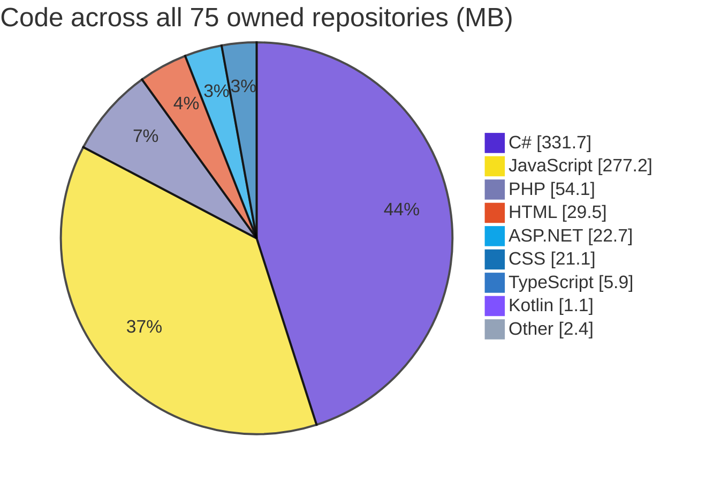
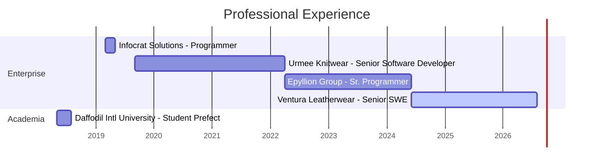

<div align="center">


[](https://mdalaminmiah.vercel.app/)

<a href="https://mdalaminmiah.vercel.app/"></a>
<a href="https://www.linkedin.com/in/mdalaminmiah/"></a>
<a href="mailto:mdalaminmiah4625@gmail.com"></a>
<a href="https://wa.me/8801712410603"></a>
<a href="https://www.hackerrank.com/profile/mdalaminmiah4625"></a>

<br/>


=======

<div align="center">

[](https://www.linkedin.com/in/mdalaminmiah/)
[](https://mdalaminmiah.vercel.app/)
[](https://github.com/mdalaminmiah)
[](https://www.facebook.com/md.a.hossain)
[](mailto:mdalaminmiah4625@gmail.com)
[](https://www.hackerrank.com/mdalaminmiah4625)

</div>

---

## 👨‍💻 About Me

> **"I turn complex factory-floor workflows into synchronized, scalable digital platforms."**

I'm a **Senior Software Engineer & ERP Architect** with **7+ years** building enterprise systems for Bangladesh's garment, textile, dyeing, printing and leather manufacturing industries. Across **5 enterprise employers** I've shipped **25+ ERP modules** — HRMS, Payroll, Production, Finance, Costing, Commercial, Inventory and Supplier portals — currently supporting **63 production lines and 10 workshops**.

My foundation is the **.NET ecosystem and SQL Server**, and I'm now building production systems on **React 19, Next.js, Node.js and TypeScript** — from AI voice agents to Android device-management platforms.

```text
🔭  Senior Software Engineer @ Ventura Leatherwear Mfy (BD) Ltd.  ·  Jun 2024 → Present
     Leading HRMS, Production & Finance ERP across 63 production lines and 10 workshops

🌱  Levelling up   ·  TypeScript · Prisma · PostgreSQL · Docker · AWS · GitHub Actions · RAG
🤖  Exploring      ·  AI agents — Vapi/Retell voice AI, LangChain, n8n, OpenAI & Claude APIs
🏗️  Architecting   ·  Clean Architecture · CQRS + MediatR · Microservices · DDD
💬  Ask me about   ·  ASP.NET Core · C# · SQL Server tuning · ERP design · Dapper · SSRS
🎯  Open to        ·  Senior / Lead Engineer roles — remote or relocation
```

---

## 📊 What I Actually Build

GitHub's public language cards only see my **27 public repos** — but most of my engineering lives in **75 owned repositories**, the majority private enterprise work. Here's the honest picture, measured across _all_ of them:



<div align="center">

**331 MB of C#** · **277 MB of JavaScript** · **54 MB of PHP** — roughly 65% of it behind private enterprise repositories.

</div>

---

## 🗓️ Career Timeline



---

## 🛠️ Tech Stack

<table>
<tr><td valign="top" width="50%">

**◈ Languages**


</td><td valign="top" width="50%">

**◈ Backend**


</td></tr>
<tr><td valign="top">

**◈ Frontend**


</td><td valign="top">

**◈ Databases**


</td></tr>
<tr><td valign="top">

**◈ Architecture**


</td><td valign="top">

**◈ DevOps & Cloud**


</td></tr>
<tr><td valign="top">

**◈ Reporting & BI**


</td><td valign="top">

**◈ AI & Tooling**


</td></tr>
</table>

---

## 📈 GitHub Statistics

> Live cards — they refresh on every page load and follow GitHub's light/dark theme automatically.

<div align="center">

<picture>
  <source media="(prefers-color-scheme: dark)" srcset="https://github-profile-summary-cards.vercel.app/api/cards/profile-details?username=mdalaminmiah&theme=github_dark"/>
  
</picture>

<picture>
  <source media="(prefers-color-scheme: dark)" srcset="https://github-profile-summary-cards.vercel.app/api/cards/stats?username=mdalaminmiah&theme=github_dark"/>
  
</picture>
<picture>
  <source media="(prefers-color-scheme: dark)" srcset="https://github-profile-summary-cards.vercel.app/api/cards/repos-per-language?username=mdalaminmiah&theme=github_dark"/>
  
</picture>
<picture>
  <source media="(prefers-color-scheme: dark)" srcset="https://github-profile-summary-cards.vercel.app/api/cards/most-commit-language?username=mdalaminmiah&theme=github_dark"/>
  
</picture>


</div>

---

## 🏭 Enterprise Work

Production systems built for manufacturing clients. These live in **private repositories** — source is proprietary, so the write-ups below describe architecture and scope only.

<table>
<tr>
<td width="50%" valign="top">

### 🖥️ VLM Core — ERP Production Dashboard

Replaced **60+ minutes of daily Excel reporting** with a live factory dashboard running on the shop floor.

`Electron 41` `React 19` `Vite 8` `SQL Server`


</td>
<td width="50%" valign="top">

### 📱 Ventura MDM — Device Management

Self-hosted **mobile device management** platform for company-owned Android hardware — enrolment, policy and remote control.

`Kotlin` `Next.js` `Node.js` `TypeScript` `MySQL 8`


</td>
</tr>
<tr>
<td width="50%" valign="top">

### 🤖 AI Appointment Scheduler

Call a number, talk to an **AI voice agent**, hang up with a real calendar appointment booked.

`Node.js 24` `Twilio` `Vapi / Retell` `Google Calendar`


</td>
<td width="50%" valign="top">

### 🏗️ VLMERP — Manufacturing ERP API

Backend foundation for the next generation of factory modules across the group.

`ASP.NET Core 10` `C# 14` `Dapper` `SQL Server`


</td>
</tr>
<tr>
<td width="50%" valign="top">

### 🛍️ Clothing Store — E-Commerce, POS & ERP

Storefront, shop counter and accounts department unified in a single **Turborepo** monorepo.

`Next.js 14` `Express` `Prisma` `MySQL 8` `Docker`


</td>
<td width="50%" valign="top">

### 🎂 MishtiCake — Bakery Commerce

_Build Your Own Cake_ studio with live pricing, flowing through kitchen to delivery.

`Next.js 15` `React 19` `Prisma` `MySQL 8`


</td>
</tr>
</table>

<details>
<summary><b>▶ Knitting, Dyeing & Printing ERP + HRMS — full module breakdown</b></summary>

<br/>

Industrial ERP running inventory, production, accounts and payroll.
**Stack:** ASP.NET Core (N-Tier / Micro-Architecture) · C# · AngularJS · SQL Server 2014/2019 · iTextSharp · Crystal Reports · EPPlus

| Module                        | Features                                                                                                                                                                                             |
| :---------------------------- | :--------------------------------------------------------------------------------------------------------------------------------------------------------------------------------------------------- |
| **User Management**           | User roles · Setup information · Data lock / unlock                                                                                                                                                  |
| **Spare Parts Inventory**     | Material receive (auto voucher) · Issue · Return from production · Return to supplier                                                                                                                |
| **Dyes & Chemical Inventory** | Opening balance · Receive (auto voucher) · Dyeing chemical issue (recipe/manual) · Re-match & re-dyeing issue · Printing chemical issue · Boiler & ETP issue · Returns · Loan adjustment · Valuation |
| **Accounts**                  | Opening balance (A/C head) · Supplier item-wise loan opening · Account heads · Debit / credit / journal vouchers                                                                                     |
| **Commercial**                | Dyeing PI · Printing PI · Item-wise dyes & chemical LC open                                                                                                                                          |
| **Cheque Management**         | Bank account entry · Cheque book entry · Cheque issue (print & preview) · Personal cheque print                                                                                                      |

</details>

---

## 🚀 Open Source & Public Projects

<table>
<tr><th align="left">Project</th><th align="left">What it does</th><th align="left">Stack</th><th align="left">Links</th></tr>

<tr><td valign="top"><b>🎓 SkillSphere</b></td>
<td valign="top">Online learning platform — browse courses, view lessons, enrol in skill programs.</td>
<td valign="top"><code>Next.js App Router</code> <code>Tailwind</code> <code>BetterAuth</code></td>
<td valign="top"><a href="https://github.com/mdalaminmiah/b13-a8-skillsphere-app">Code</a> · <a href="https://b13-a8-skillsphere-app.vercel.app">Live</a></td></tr>

<tr><td valign="top"><b>🤝 KeenKeeper</b></td>
<td valign="top">Personal relationship manager with interaction logging and analytics.</td>
<td valign="top"><code>Next.js</code> <code>React 19</code> <code>Recharts</code> <code>Tailwind v4</code></td>
<td valign="top"><a href="https://github.com/mdalaminmiah/b13-a7-keen-keeper-app">Code</a> · <a href="https://keenkeeper.vercel.app">Live</a></td></tr>

<tr><td valign="top"><b>🏟️ SportNest</b></td>
<td valign="top">Book football turfs, tennis courts, swimming lanes and badminton halls by date and time slot — JWT in HTTPOnly cookies, Google OAuth via BetterAuth.</td>
<td valign="top"><code>Next.js</code> <code>Express 5</code> <code>MongoDB</code> <code>Mongoose</code> <code>DaisyUI</code></td>
<td valign="top"><a href="https://github.com/mdalaminmiah/sportnest-api">API</a> · <a href="https://github.com/mdalaminmiah/sportnest-client">Client</a> · <a href="https://sportnest-api.vercel.app">Live API</a></td></tr>

<tr><td valign="top"><b>🩺 DevPulse API</b></td>
<td valign="top">Internal issue & feature tracker. <b>Raw SQL only</b> — native <code>pg</code>, no ORM, no query builder, no JOINs.</td>
<td valign="top"><code>Node.js</code> <code>TypeScript</code> <code>Express</code> <code>PostgreSQL</code> <code>JWT</code></td>
<td valign="top"><a href="https://github.com/mdalaminmiah/devpulse">Code</a></td></tr>

<tr><td valign="top"><b>🎟️ TicketBari</b></td>
<td valign="top">Three-role ticketing marketplace with Stripe payments and atomic seat inventory.</td>
<td valign="top"><code>React 19</code> <code>TypeScript</code> <code>Express 5</code> <code>MongoDB</code> <code>Stripe</code> <code>Tailwind v4</code></td>
<td valign="top"><a href="https://github.com/mdalaminmiah/online-ticket-booking-platform_Client">Client</a> · <a href="https://github.com/mdalaminmiah/online-ticket-booking-platform_Server">Server</a></td></tr>

<tr><td valign="top"><b>📲 VLM Automation</b></td>
<td valign="top">Hardened native Android shell wrapping the factory automation web app in a WebView.</td>
<td valign="top"><code>Java</code> <code>Android SDK 36</code> <code>WebView</code> <code>Material 3</code></td>
<td valign="top"><a href="https://github.com/mdalaminmiah/AutomationApp">Code</a></td></tr>

<tr><td valign="top"><b>🧮 Advanced Problem Solving</b></td>
<td valign="top">TypeScript & OOP problem-solving exercises and patterns.</td>
<td valign="top"><code>TypeScript</code> <code>OOP</code></td>
<td valign="top"><a href="https://github.com/mdalaminmiah/B07-A01-Advanced-Problem-Solving">Code</a></td></tr>

</table>

<details>
<summary><b>▶ Earlier work — C# / ASP.NET & Java desktop systems</b></summary>

<br/>

| Project                              | Stack                                          | Code                                                                                                                |
| :----------------------------------- | :--------------------------------------------- | :------------------------------------------------------------------------------------------------------------------ |
| 🎓 University Management System      | ASP.NET MVC · C# · SQL Server · Bootstrap      | [Repo](https://github.com/mdalaminmiah/University-Mangement-Syatem-Application-By-AspDotNet)                        |
| 🏥 Diagnostic Bill Management System | ASP.NET Three-Layer · C# · SQL Server · jQuery | [Repo](https://github.com/mdalaminmiah/Diagnostic-Bill-management-System)                                           |
| 🏨 Hospital Management System        | Java · OOP · Swing                             | [Repo](https://github.com/mdalaminmiah/Hospital-Management-System-By-Java)                                          |
| 🚂 Railway Ticket Management System  | Java · Swing · SQL Server                      | [Repo](https://github.com/mdalaminmiah/Railway-Ticket-Management-System-By-Java)                                    |
| 👩‍🎓 Student Information System        | Java · OOP · Swing                             | [Repo](https://github.com/mdalaminmiah/Student-Information-System-By-Java)                                          |
| 🩸 Blood Donor Management System     | Java · OOP                                     | [Repo](https://github.com/mdalaminmiah/Blood-Donar-Management-System-By-Java)                                       |
| 📱 Android Mini Projects & API       | Java · Android SDK                             | [Apps](https://github.com/mdalaminmiah/AndroidMiniProjectCode) · [API](https://github.com/mdalaminmiah/Android-API) |

</details>

---

## 💼 Experience

| Role                           | Organisation                      | Period              | Focus                                                    |
| :----------------------------- | :-------------------------------- | :------------------ | :------------------------------------------------------- |
| **Senior Software Engineer**   | Ventura Leatherwear Mfy (BD) Ltd. | Jun 2024 – Present  | HRMS · Production & Finance ERP · 63 lines, 10 workshops |
| **Sr. Programmer**             | Epyllion Group, Dhaka             | Apr 2022 – Jun 2024 | Multi-company Garments / Textile ERP suite               |
| **Senior Software Developer**  | Urmee Knitwear Limited, Dhaka     | Sep 2019 – Apr 2022 | Knitting, Dyeing & Printing ERP · Accounts · HRMS        |
| **Programmer**                 | Infocrat Solutions Ltd., Dhaka    | Mar 2019 – May 2019 | ERP application & database development                   |
| **Student Prefect (Teaching)** | Daffodil International University | May 2018 – Aug 2018 | Operating Systems lab                                    |

<details>
<summary>▶ Detailed responsibilities & project contributions</summary>

<br/>

**Ventura Leatherwear Mfy (BD) Ltd.** — _Senior Software Engineer_
Enterprise software across **HRMS, Production & Finance ERP** on .NET Core and PHP (Laravel, CodeIgniter). Backend services in ASP.NET Core, C# and Web API; modular architecture with Microservices and CQRS using Autofac and MediatR; relational and NoSQL schema design and tuning across SQL Server, MySQL, PostgreSQL and MongoDB; SSRS/RDLC reporting with automated PDF/Excel generation; dashboards in Power BI, Chart.js and Morris.js; full SDLC plus on-site and remote ERP rollout support.
_Projects:_ HRMS · Production & Finance ERP · Automation · Paper Free · MDM · AI Scheduler

**Epyllion Group** — _Sr. Programmer_
Requirement analysis and database architecture for a multi-company garments and textile ERP suite; custom report development and optimisation; post-deployment support driven by QC and user feedback; on-site support across branches nationwide.
_Projects:_ Garments ERP · Textile ERP · Accessories ERP · Expense Management · Accounts & Finance · Supplier Portal · Sailor ERP

**Urmee Knitwear Limited** — _Senior Software Developer_
Led full-cycle development of the Knitting, Dyeing & Printing ERP plus Accounts, Cheque and HRMS modules; high-quality database design; report scripting; white-box testing; post-deployment enhancement.
_Projects:_ Dyeing / Knitting / Printing ERP · Accounts & Finance · Digital Cheque Management · Expense Management · HRMS

**Infocrat Solutions Ltd.** — _Programmer_
Application and database development across multiple ERP products, report scripting and white-box testing.
_Projects:_ Garments ERP · Textile ERP · Accessories ERP · Accounts & Finance · Bangladesh Eye Hospital ERP

**Daffodil International University** — _Student Prefect_
Assisted teaching the **Operating Systems** lab course and supported course administration.

</details>

---

## 🎓 Education & Certifications

| Degree                                      | Institution                              | Period      | Result           |
| :------------------------------------------ | :--------------------------------------- | :---------- | :--------------- |
| **B.Sc. in Computer Science & Engineering** | Daffodil International University, Dhaka | 2014 – 2018 | CGPA 3.21 / 4.00 |
| **HSC (Science)**                           | Lions School & College, Rangpur          | 2010 – 2012 | GPA 4.20 / 5.00  |
| **SSC (Science)**                           | Shukurer Hat High School, Rangpur        | 2009 – 2010 | GPA 4.13 / 5.00  |

**🔄 Currently training**


<details>
<summary>▶ Training detail & completed certifications</summary>

<br/>

| Programme                                      | Provider         | Period         | Technologies                                                                                                                   |
| :--------------------------------------------- | :--------------- | :------------- | :----------------------------------------------------------------------------------------------------------------------------- |
| Next Level AI-Driven Software Engineering (L2) | Programming Hero | Apr – Oct 2026 | TypeScript · Node · Express · PostgreSQL · Prisma · Docker · Nginx · AWS (EC2/S3/IAM) · GitHub Actions · RAG & pgvector · Jest |
| Complete Web Development (L1)                  | Programming Hero | Jan – Jun 2026 | React · Next.js · Tailwind · DaisyUI · Express · MongoDB · JWT                                                                 |
| AI Agent Mastery — Build, Automate & Scale     | Hablu Programmer | Jun – Nov 2026 | n8n · LangChain · Langflow · OpenAI · Claude · RAG · Voice AI                                                                  |

| Completed Certification                  | Issuer                                                            | Date           |
| :--------------------------------------- | :---------------------------------------------------------------- | :------------- |
| SQL (Intermediate) — `70428DE18823`      | [HackerRank](https://www.hackerrank.com/profile/mdalaminmiah4625) | Sep 2021       |
| SQL (Basic) — `26AC2F21B0C7`             | [HackerRank](https://www.hackerrank.com/profile/mdalaminmiah4625) | Sep 2021       |
| Mobile Application Development (Android) | ICT Ministry, Bangladesh                                          | May – Nov 2018 |
| App Monetization & Management            | ICT Ministry, Bangladesh                                          | May – Aug 2018 |
| Web Application Development — .NET       | BITM                                                              | Jul – Nov 2017 |

</details>

---

## 🌟 Beyond Code

**Leadership:** Technical Leadership · Team Management & Mentoring · Project Management · Agile / SDLC · Stakeholder Communication

**Languages:** 🇧🇩 Bangla (Native) · 🇬🇧 English (Fluent) · 🇯🇵 Japanese (Elementary — Hiragana & Katakana)

**Communities:** Young Bangla · BASIS Student Forum · Google Developer Group Dhaka

**Interests:** ✈️ Traveling · 📚 Reading · 🎵 Music · ⚽ Football & Cricket · 🩸 Blood Donation

---

<div align="center">

## 🤝 Let's Work Together

**Open to Senior / Lead Engineer roles — remote or relocation.**

<a href="https://mdalaminmiah.vercel.app/"></a>
<a href="https://www.linkedin.com/in/mdalaminmiah/"></a>
<a href="mailto:mdalaminmiah4625@gmail.com"></a>
<a href="https://wa.me/8801712410603"></a>
<a href="https://www.hackerrank.com/profile/mdalaminmiah4625"></a>
<a href="https://www.facebook.com/md.a.hossain"></a>

**📍** Rangpur, Bangladesh &nbsp;·&nbsp; **✉️** [mdalaminmiah4625@gmail.com](mailto:mdalaminmiah4625@gmail.com) &nbsp;·&nbsp; **🕙** Reachable 10:00 – 22:00 (GMT+6)


</div>
